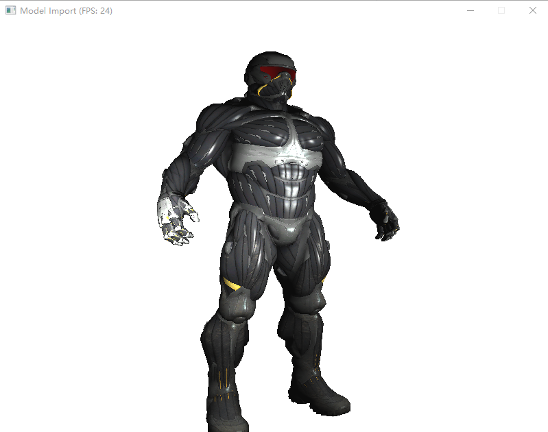

### 透视效果

### 光照效果

### 待实现的功能
- [ ] Editor
    - [ ] Scene Serialization
    - [ ] Manipulation Gizmo

- [ ] Renderer
    - [x] SDL窗口工具
    - [x] Assimp模型工具
    - [x] Bresenham画线算法
    - [x] 基于扫描线的三角形填充(LineSweeping)
    - [x] 基于重心坐标的三角形填充(BarycentricCoordinates)
    - [ ] 灵活的摄像机实现
    - [X] 视锥体裁剪
    - [ ] light 光源（点光源，方向光，区域光，纹理光）
    - [ ] 物体（平面，三角形，球，四棱柱，圆柱，圆盘）
    - [ ] GPU架构(TBDR(分块延迟渲染)/CBDR)
    - [ ] Occlusion Culling
    - [ ] CSM/PCSS
    - [ ] Stochastic SSR
    - [ ] 多种表面的BSDF
    - [ ] 全局光照
    - [ ] 路径追踪
    - [ ] 蒙特卡洛积分
    - [ ] 俄罗斯轮盘赌Russian Roulette
    - [ ] 纹理（Solid，Procedural，Cellular）
    - [ ] 反走样(SSAA, MSAA, TAA)
    - [ ] 景深Depth of field
    - [ ] 加速数据结构（BVH）
    - [ ] 切线空间法线贴图（Tangent space normal mapping）
    - [ ] 阴影贴图（Shadow mapping）
    - [ ] 延迟渲染（Deferred Shading）
    - [ ] 用于环境光照的Image-based lighting（IBL）
    - [ ] 光或者反射探针 Light/Reflection probe
- [ ] Mono
- [ ] Particle System
- [ ] Animation System

#### 参考资料
- [如何写一个软渲染[拳四郎]](https://zhuanlan.zhihu.com/p/42725758)
- [如何开始用 C++ 写一个光栅化渲染器？](https://www.zhihu.com/question/24786878/answer/127484388) 
- [Tiny renderer or how OpenGL works: software rendering in 500 lines of code](https://github.com/ssloy/tinyrenderer/wiki)
- [Scratchapixel](https://www.scratchapixel.com/index.php)